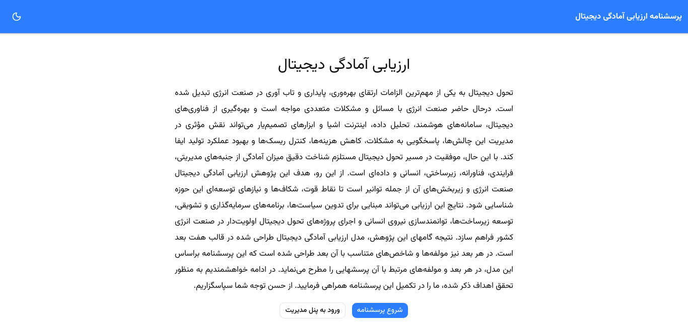
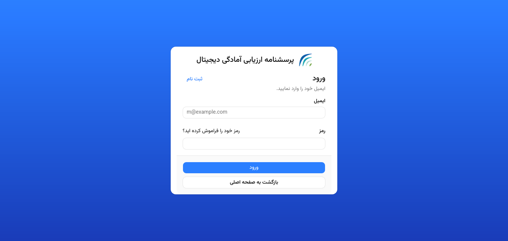
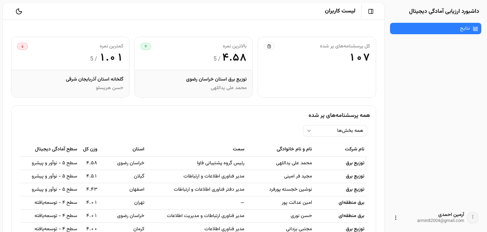
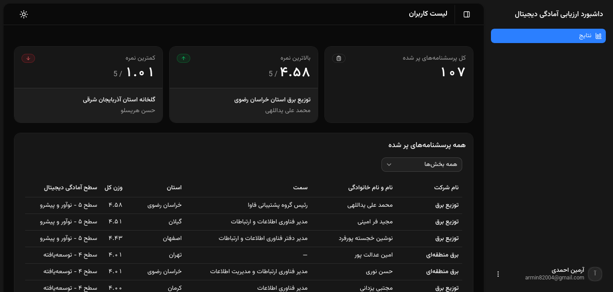
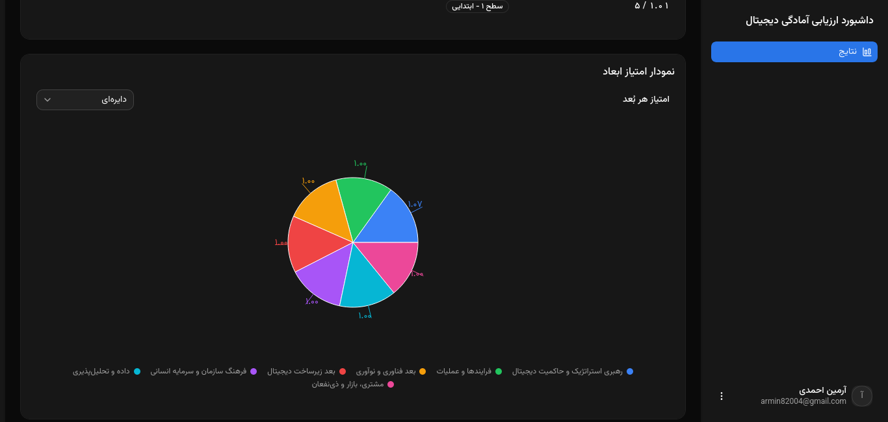

# Digital Readiness Assessment Dashboard






## Information and Communication Technology Research Institute

A web-based **Digital Readiness Assessment System** developed for the **Information and Communication Technology Research Institute (ICT Research Institute)** to assess the digital readiness of organizations and subsectors within the energy industry.

The system provides a structured questionnaire based on a research-driven digital readiness assessment model and presents the collected data through an administrative dashboard for analysis and evaluation.

## Overview

Digital transformation has become an important requirement for improving productivity, sustainability, resilience, and operational performance in the energy industry.

The adoption of digital technologies such as:

* Smart systems
* Data analytics
* Internet of Things (IoT)
* Digital infrastructure
* Decision-support systems
* Intelligent technologies

can help organizations address operational challenges, reduce costs, manage risks, improve decision-making, and enhance overall performance.

However, successful digital transformation requires a clear understanding of an organization's current level of digital readiness across different managerial, process, technological, infrastructure, human-resource, and data-related aspects.

This project provides a structured framework for evaluating these aspects and identifying **strengths, digital gaps, and development priorities**.

## Purpose

The primary purpose of this research project is to assess the **digital readiness of the energy industry and its subsectors, including TAVANIR**, and to provide evidence that can support:

* Digital transformation policies
* Investment planning
* Development of digital infrastructure
* Human-resource empowerment
* Identification of digital capability gaps
* Prioritization of digital transformation projects
* Strategic decision-making

The results of the assessment can serve as an analytical basis for planning and implementing digital transformation initiatives within the energy sector.

## Assessment Model

The assessment model developed as part of this research consists of **seven dimensions**.

Each dimension contains a set of relevant **components**, and each component contains a set of **indicators**.

The questionnaire is structured according to this hierarchical model:

```text
Digital Readiness Assessment
│
├── Dimension 1
│   ├── Components
│   │   ├── Indicators
│   │   └── Questions
│   └── ...
│
├── Dimension 2
│   ├── Components
│   └── ...
│
├── ...
│
└── Dimension 7
    ├── Components
    └── Indicators
```

The questionnaire evaluates each dimension through questions associated with its corresponding components and indicators.

## Assessment Process

The general assessment workflow is:

```text
Start
  │
  ▼
Select Industry
  │
  ▼
Select Organization / Business Type
  │
  ▼
Complete Questionnaire
  │
  ▼
Calculate Assessment Scores
  │
  ▼
Analyze Results
  │
  ▼
Digital Readiness Dashboard
```

The system is designed to transform questionnaire responses into structured assessment results that can be analyzed at different levels of the assessment model.

## Current Scope

The current implementation focuses primarily on the **energy industry** and its relevant subsectors.

One of the main assessment areas is **TAVANIR**, with the architecture designed to support additional industries and subsectors in future versions.

The underlying model can be extended by adding:

* New industries
* New subsectors
* New dimensions
* New components
* New indicators
* New assessment questions

without fundamentally changing the overall application architecture.

## Key Features

### Digital Readiness Questionnaire

* Structured multi-dimensional questionnaire
* Industry-specific assessment
* Organization/subsector selection
* Dimension-based assessment
* Component and indicator-based questions
* Weighted assessment criteria
* Structured response collection

### Assessment Engine

The assessment engine processes questionnaire responses according to the defined assessment model.

The conceptual scoring hierarchy is:

```text
Question Response
       │
       ▼
   Indicator
       │
       ▼
   Component
       │
       ▼
   Dimension
       │
       ▼
Overall Digital Readiness
```

This hierarchical approach enables the system to analyze digital readiness at multiple levels rather than relying only on a single overall score.

### Management Dashboard

The administrative dashboard provides an interface for managing and analyzing assessment data.

Depending on the configured assessment model, the dashboard can provide information such as:

* Assessment records
* Respondent information
* Indicator scores
* Component scores
* Dimension scores
* Overall assessment results
* Comparative analysis
* Data visualizations

## Technology Stack

### Frontend

* **Next.js**
* **React**
* **TypeScript**
* **shadcn/ui**
* **Recharts**

### Backend

* **Next.js**
* **PostgreSQL**
* **Better Auth**

### Deployment

* **Vercel**

### Package Manager

* **pnpm**

## Project Architecture

The application follows a modern Next.js application architecture.

A simplified representation of the project structure is:

```text
digital-assessment-dashboard/
│
├── app/
│   ├── assessment/
│   ├── dashboard/
│   ├── api/
│   └── _components/
│
├── components/
│   └── ui/
│
├── lib/
│   └── ...
│
├── data/
│   └── questionnaire/
│
├── public/
│
├── package.json
├── pnpm-lock.yaml
├── tsconfig.json
└── README.md
```

The exact project structure may evolve as new assessment features are introduced.

## Data Model

The assessment data follows a hierarchical structure:

```text
Industry
   │
   ▼
Dimension
   │
   ▼
Component
   │
   ▼
Indicator
   │
   ▼
Question
   │
   ▼
Answer
   │
   ▼
Assessment Score
```

This structure allows the system to maintain a clear relationship between questionnaire responses and the corresponding assessment indicators, components, and dimensions.

## Authentication

The management dashboard uses **Better Auth** for authentication and user management.

Authentication is used to control access to protected areas of the application, particularly administrative functionality and assessment management.

## Database

The application uses **PostgreSQL** as its primary database.

The database is responsible for storing application data such as:

* Users
* Assessments
* Questionnaire responses
* Assessment results
* Indicators
* Components
* Dimensions
* Industry-specific information

The database structure is designed to support the hierarchical assessment model and future expansion of the research framework.

## Data Visualization

The dashboard uses **Recharts** for data visualization.

Visualization components can be used to represent assessment results across different dimensions and components, making it easier to identify:

* Strong areas
* Weak areas
* Digital capability gaps
* Dimension-level performance
* Overall digital readiness

## Installation

Clone the repository:

```bash
git clone <repository-url>
cd digital-assessment-dashboard
```

Install dependencies:

```bash
pnpm install
```

## Environment Variables

Create a `.env.local` file and configure the required environment variables:

```env
DATABASE_URL="your-postgresql-connection-string"

BETTER_AUTH_SECRET="your-secret"

NEXT_PUBLIC_APP_URL="http://localhost:3000"
```

Do not commit sensitive credentials or secrets to the repository.

## Development

Start the development server:

```bash
pnpm dev
```

The application will be available at:

```text
http://localhost:3000
```

## Production

Build the application:

```bash
pnpm build
```

Start the production server:

```bash
pnpm start
```

## Research Context

This application is part of a research initiative conducted for the **Information and Communication Technology Research Institute (ICT Research Institute)**.

The system operationalizes the research-developed **Digital Readiness Assessment Model** as an interactive web-based questionnaire and analytical dashboard.

The assessment model consists of seven dimensions, with each dimension containing relevant components and indicators. The resulting data can be used to identify the current state of digital readiness, determine capability gaps, and support the development of digital transformation strategies for the energy industry.

## Future Development

Potential future improvements include:

* [ ] Support for additional industries and subsectors
* [ ] Full questionnaire management through the dashboard
* [ ] Dimension, component, and indicator management
* [ ] Advanced role-based access control
* [ ] PDF assessment reports
* [ ] Excel export
* [ ] Assessment comparison
* [ ] Historical assessment tracking
* [ ] Trend analysis
* [ ] Advanced dashboard analytics
* [ ] Advanced filtering and search
* [ ] Versioning of assessment models
* [ ] Automated assessment reporting

## Live Application

The current online version of the Digital Readiness Assessment System is available at:

**https://digital-assessment-dashboard-gcjx.vercel.app/**

## Organization

**Information and Communication Technology Research Institute (ICT Research Institute)**

The system has been developed as a research-oriented platform for assessing digital readiness and supporting digital transformation analysis within the energy industry.
